# Udemy - Complete Guide to Protocol Buffers 3 [Java, Golang, Python] 2021-9

# Introduction 

## the need for protocol buffers

**Evolution of data**

**csv**

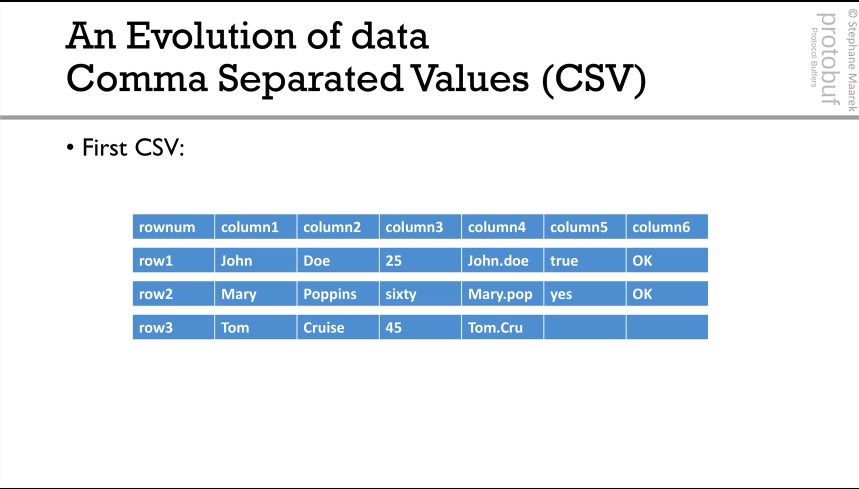

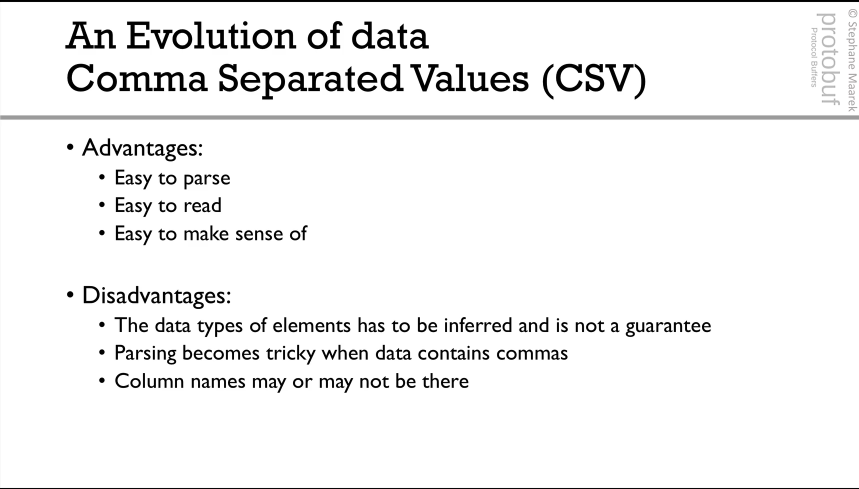

**Relational tables definitions**

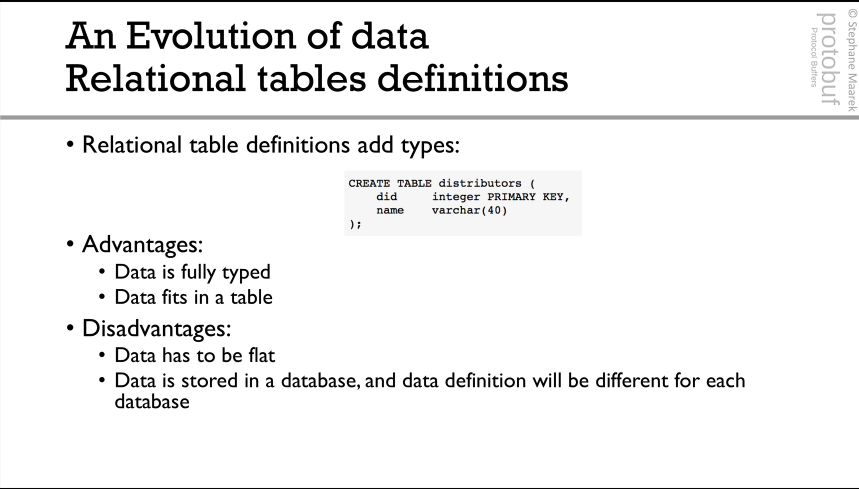

**JSON**

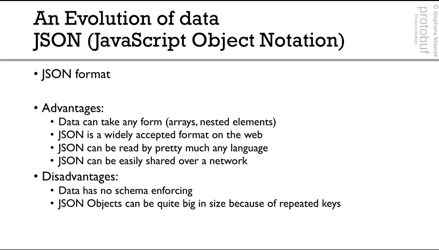

**Protocol Buffers**

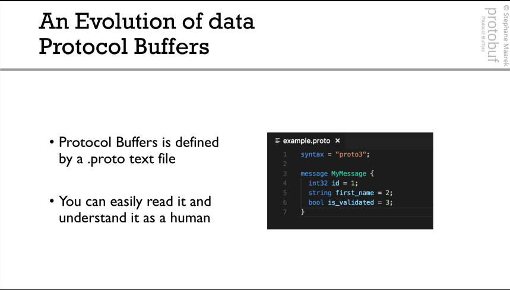
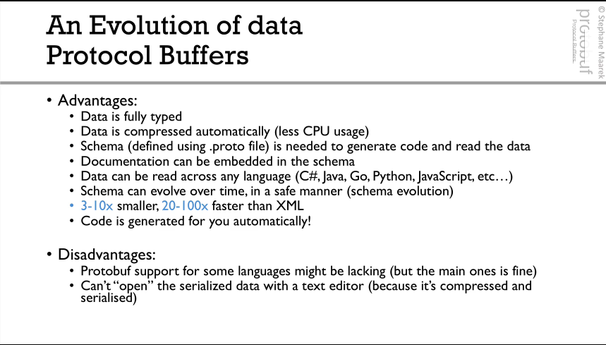
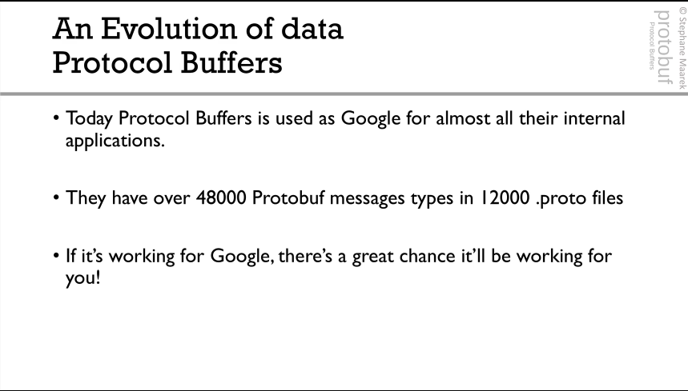

## How are Protocol Buffers used

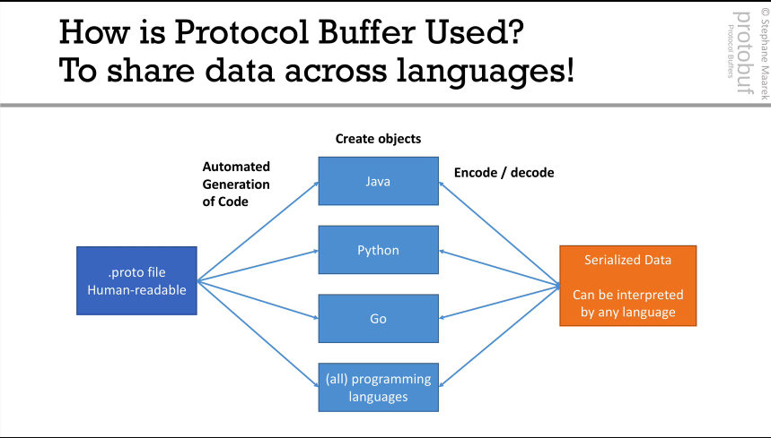
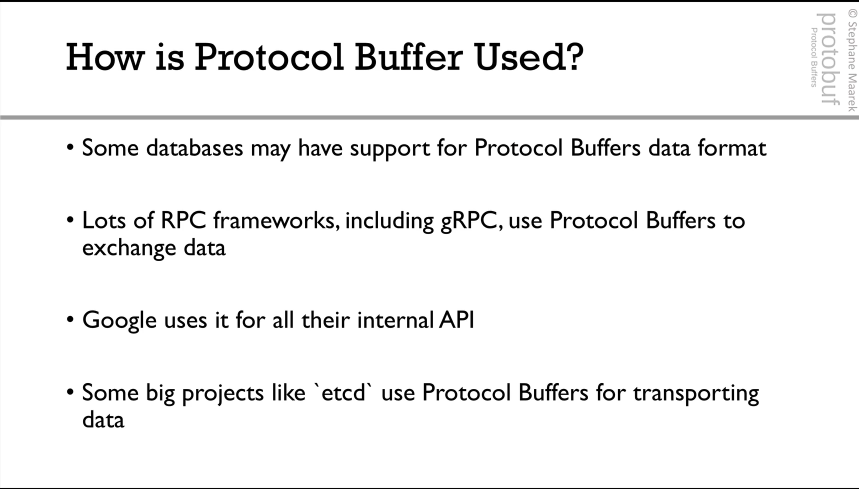

**Proto2 vs Proto3**

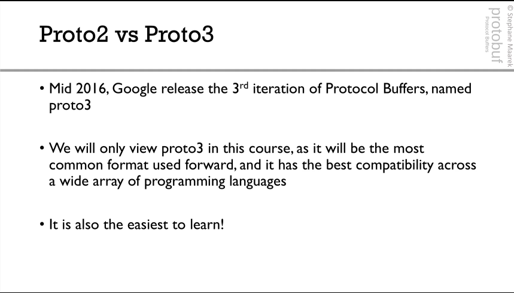

-------------------------

# Protocol Buffers Basics 1

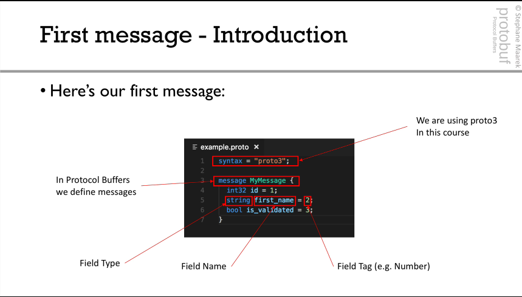

## Scalar Types 

**Number**

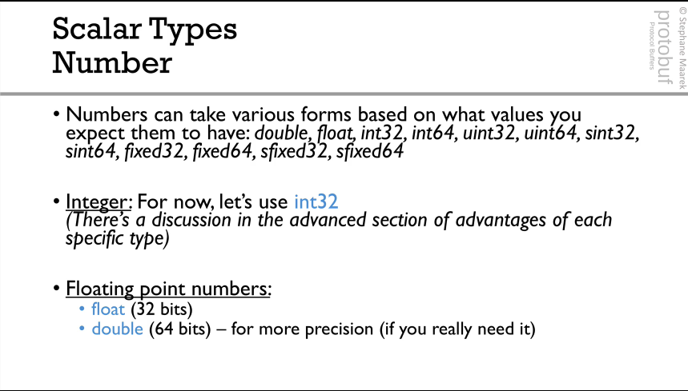

**Boolean**

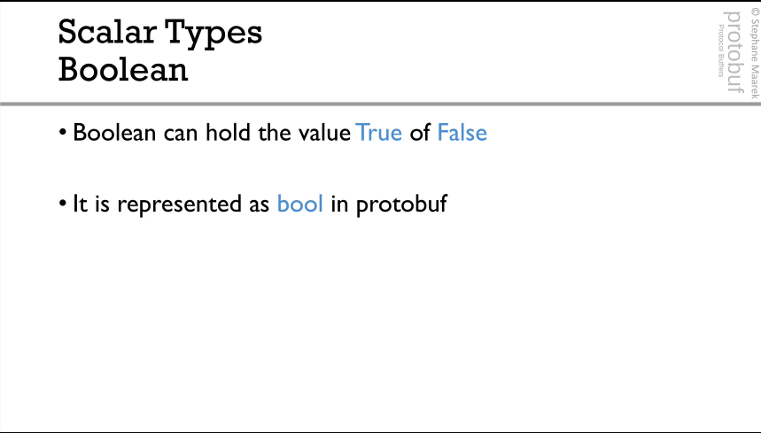

**String**

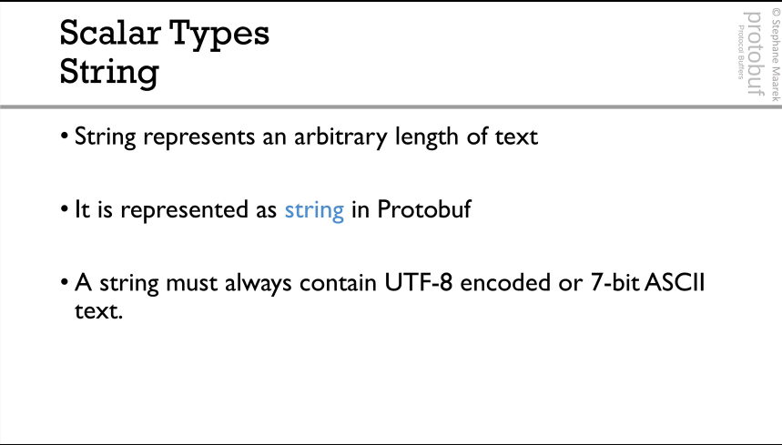

**Bytes**

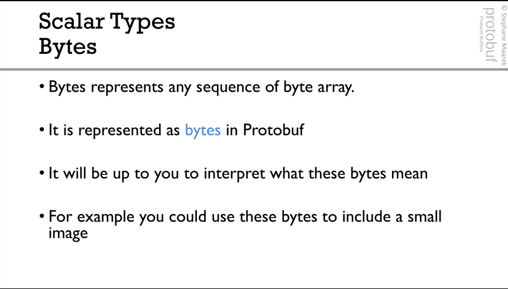

**Summary: Types**

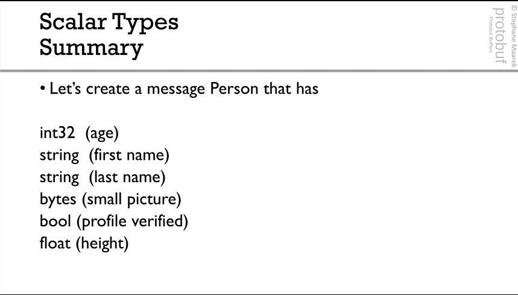

## Tags
