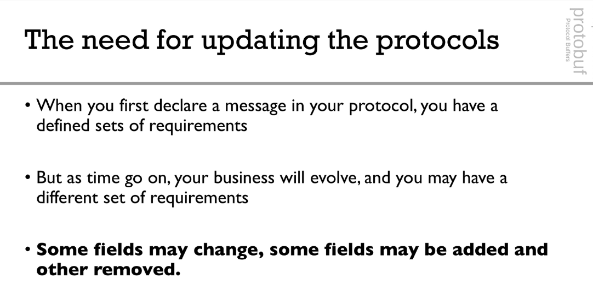

# Udemy - Complete Guide to Protocol Buffers 3 [Java, Golang, Python] 2021-9

# Introduction 

## the need for protocol buffers

**Evolution of data**

**csv**


**Relational tables definitions**


**JSON**


**Protocol Buffers**


## How are Protocol Buffers used


**Proto2 vs Proto3**


-------------------------

# Protocol Buffers Basics 1


## Scalar Types 

**Number**


**Boolean**


**String**


**Bytes**


**Summary: Types**


## Tags 


## Repeated Fields


## Comments


## Default Values for fields


## Enums


-------------------

# Protocol Buffers Basics

## Defining Multiple Message in the same .proto file


## Nesting Types


## Importing Types


## Packages


---------------
# setting up protoc compiler

```text

In order to perform code generation, you will need to install protoc on your computer.

============ MacOSX =============

It is actually very easy, open a command line interface and type brew install protobuf

============ Ubuntu (Linux) ============

Find the correct protocol buffers version based on your Linux Distro:https://github.com/google/protobuf/releases

Example with x64:

# Make sure you grab the latest version
curl -OL https://github.com/google/protobuf/releases/download/v3.5.1/protoc-3.5.1-linux-x86_64.zip
# Unzip
unzip protoc-3.5.1-linux-x86_64.zip -d protoc3
# Move protoc to /usr/local/bin/
sudo mv protoc3/bin/* /usr/local/bin/
# Move protoc3/include to /usr/local/include/
sudo mv protoc3/include/* /usr/local/include/
# Optional: change owner
sudo chown [user] /usr/local/bin/protoc
sudo chown -R [user] /usr/local/include/google
============ Windows============

Download the windows archive:https://github.com/google/protobuf/releases

Example:https://github.com/google/protobuf/releases/download/v3.5.1/protoc-3.5.1-win32.zip

Extract all to C:\proto3

Your directory structure should now be

C:\proto3\bin

C:\proto3\include

Finally, add C:\proto3\bin to your PATH:

From the desktop, right-click My Computer and click Properties.
In the System Properties window, click on the Advanced tab
In the Advanced section, click the Environment Variables button.
Finally, in the Environment Variables window (as shown below), highlight the Path variable in the Systems Variable section and click the Edit button. Add or modify the path lines with the paths you wish the computer to access. Each different directory is separated with a semicolon as shown below.

C:\Program Files; C:\Winnt; ......; C:\proto3\bin
(you need to add; C:\proto3\bin at the end)
```

`protoc -I=proto --go_out=go .\proto\person.proto`


```text
If you want to follow along with me, please have the following:

- Golang installed:https://golang.org/doc/install

- VSCode Installed

- The VSCode Golang extension:https://code.visualstudio.com/docs/languages/go

- The source code for this project (download / star the project):https://github.com/simplesteph/protobuf-example-go

- Golangpackages:

go get -u github.com/golang/protobuf/protoc-gen-go
go get -u github.com/golang/protobuf/proto
- Protoc Compiler (see Setting up Protoc Compiler Section)
```

------------------

# Data Evolution with Protobuf

## The need for updating the protocols




## Updating Protocol Rules


9-3